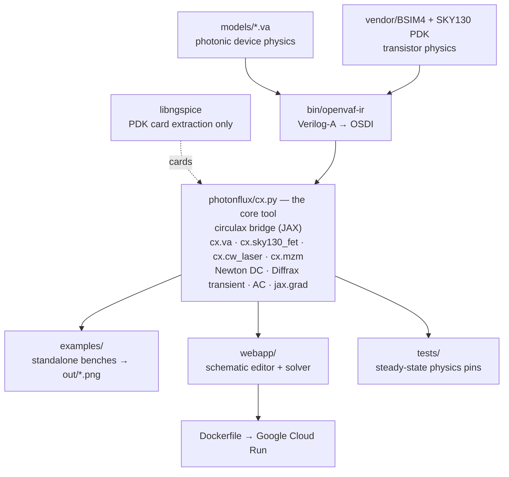

# Photonflux — Verilog-A photonics + SKY130 electronics

Photonflux simulates **Verilog-A photonic compact models** together with **real
SKY130 PDK transistors** inside [circulax](https://github.com/gdsfactory/circulax)
(gdsfactory's differentiable JAX/Diffrax circuit simulator). Optics and
electronics live in **one JAX system** — Newton DC, Diffrax transient, AC, and
`jax.grad` run end-to-end through the photonics. Use it two ways: as a Python
library, or as a browser-based schematic editor + simulator.

```python
from photonflux import cx

LASER = cx.cw_laser()                                # CW: wavelength + power -> field E
MOD   = cx.mzm()                                     # field-convention MZM (twin of models/optical_power/mzm.va)
RING  = cx.va("ring_mod")                            # any models/*.va -> differentiable JAX component
NFET  = cx.sky130_fet("nfet_01v8", w=1.0, l=0.15)    # real SKY130 BSIM4 device (um, tt corner)
```

All four drop into circulax netlists as ordinary components.

**House conventions**

* Optical nodes carry the **coherent field** (complex `E`, power = `|E|²`).
* Lasers are **CW only** — parameterised by wavelength and power, emitting a
  constant field. All modulation happens in modulators (`cx.mzm()`, or ideal
  modulators like the `PulseModulator` in example 01); a laser is never
  modulated directly.

## Architecture

There is **one simulator: circulax**. Verilog-A models and SKY130 transistors
are compiled to OSDI, lowered to JAX by [`photonflux/cx.py`](photonflux/cx.py),
and everything user-facing — the examples, the web app, the tests — solves
through it. `libngspice` is present only so that ngspice can resolve the SKY130
PDK and hand back BSIM4 model cards; it never simulates a circuit.



## Quick start

```bash
# one-time environment (Python 3.12, native on Apple Silicon)
python3 -m venv .venv-circulax
.venv-circulax/bin/pip install "circulax[verilog-a]" openvaf-py
.venv-circulax/bin/pip install -e .

# SKY130 PDK (used for FET model-card extraction)
.venv-circulax/bin/pip install volare
.venv-circulax/bin/python -m volare enable --pdk sky130 <commit>   # -> ~/.volare/sky130A

# run a standalone example, or the tests
.venv-circulax/bin/python examples/link_sky130.py    # -> out/link_sky130.png
.venv-circulax/bin/python -m pytest tests/           # circulax model-physics pins

# or build circuits in the browser (drag-drop schematic editor + plotting)
.venv-circulax/bin/python webapp/server.py           # -> http://localhost:8642
```

## Browser app — `webapp/` ([webapp/README.md](webapp/README.md))

A single-file stdlib server + static frontend: drag photonic and electrical
components onto a schematic canvas, wire them (**amber = optical field, blue =
electrical**), edit parameters, attach probes, and simulate — solved by circulax
in-process and plotted live (optical probes as `|E|²` power, electrical as
volts).

- **Six analyses:** Transient, DC operating point, AC (S-parameters), Noise
  (small-signal), Pulse / COM, and Optimize.
- **Run-configuration pane** — a caret next to **Run** opens a sweep-overlay
  panel: sweep one or two parameters over any plot-producing analysis and
  overlay the runs (shaded by step, or a distinct hue per run). The legacy fast
  DC-sweep and AC parameter-sweep paths are absorbed into it.
- **Optical spectra (OSA):** flag an optical probe and get a full
  Blackman–Harris FFT of its field beside the time-domain trace, on a shared
  wavelength axis; results export to CSV (time-domain **and** spectra).
- **40 example circuits**, grouped: photonic links, lasers/modulators (SOA
  Fabry-Perot laser, Vernier tunable ring laser, TPA/FCA-limited high-Q ring,
  χ(3) four-wave mixing in a waveguide and resonantly enhanced inside a Kerr
  ring — all from the nonlinear VA models), SKY130 device studies, channels +
  equalization, passive photonics, WDM crosstalk, and analog/digital CMOS.

## Deploy it as a public web app ([docs/README-DEPLOY.md](docs/README-DEPLOY.md))

The solver is JAX + native `circulax`, so a pure static / WebAssembly (GitHub
Pages) build isn't possible — instead **one container serves both** the static
UI and the `/api/run` solver. The image (repo-root [`Dockerfile`](Dockerfile))
builds a Linux `openvaf-ir` from source, installs circulax + the SKY130 PDK, and
pre-warms every model cache via [`webapp/warmup.py`](webapp/warmup.py). Public
builds disable Verilog-A upload and cap run time by env var.

The recommended **free** host is **Google Cloud Run** (builds in the cloud,
scale-to-zero, free tier covers a demo); see
[docs/README-DEPLOY.md](docs/README-DEPLOY.md) for the full walkthrough (Hugging Face's
Docker SDK went paid for free accounts in 2026).

## Standalone examples — `examples/` ([examples/README.md](examples/README.md))

Each script's module docstring is the full write-up; the last five also appear
as named examples 36–40 in the web app. One-line index:

| script | what it shows | output |
|---|---|---|
| `photodiode_tia.py` | CW laser → modulator → fibre → PD → TIA, with `jax.grad` through the DC solve | `out/photodiode_tia.png` |
| `link_cmos.py` | full CW + MZM link, transistor driver + CMOS-inverter TIA (no PDK) | `out/link_cmos.png` |
| `link_sky130.py` | the same link with **real SKY130 BSIM4 FETs** | `out/link_sky130.png` |
| `ring_mod_sky130.py` | Verilog-A microring modulator driven by a SKY130 inverter; DC tuning + optical eye | `out/ring_mod.png` |
| `soa_fp_laser.py` | Fabry-Perot laser from an SOA between two mirrors — lasing emerges from the loop | `out/soa_fp_laser.png` |
| `soa_vernier_laser.py` | Vernier laser seeded by ASE noise, with a live one-FSR mode hop | `out/soa_vernier_laser.png` |
| `ring_tpa_q.py` | TPA + free-carrier absorption capping a high-Q ring | `out/ring_tpa_q.png` |
| `wg_fwm.py` | χ(3) four-wave mixing in a waveguide, pinned to every textbook scaling | `out/wg_fwm.png` |
| `ring_fwm.py` | four-wave mixing **inside** a Kerr ring resonator | `out/ring_fwm.png` |
| `ring_selfheat.py` | **thermo-optic bistability** of a self-heating microring (`models/optical_field/ring_selfheat.va`) — absorbed circulating power heats a high-Q ring and red-shifts its resonance (dn/dT>0); one transient ramps the laser wavelength up then down and the through-port traces a **hysteresis loop** (thermal-locking triangle to the red, sharp cold dip to the blue), pinned to the analytic three-root self-consistency | `out/ring_selfheat.png` |

## How the SKY130 flow works

`cx.sky130_fet(device, w=..., l=..., corner="tt")`:

1. **Card extraction** — ngspice itself resolves the volare model library
   (`.lib` corner stitching, `{...}` card expressions, W/L bin selection); the
   fully-resolved BSIM4 card is read back with `showmod`. No hand-parsing of PDK
   files.
2. **Compilation** — the BSIM4.8 Verilog-A (cogenda VA-BSIM48 port, vendored in
   `vendor/BSIM4/`) is compiled to an OSDI binary by `bin/openvaf-ir`.
3. **Evaluation** — the OSDI binary runs natively inside circulax's
   Newton/transient loop (bosdi's OSDI↔JAX shim), with the card baked in and
   not-given parameters resolved by the VA's own `$param_given` ladder.

Behaviour (pinned by `tests/test_cx.py`): the nfet is off at gmin, has a
monotone `Id(Vgs)` transfer, and a physical on-current at 1.8 V; the CMOS
inverter rails to both supplies and trips near mid-supply. (The card carries
`version=4.5` / BSIM4v5, so against true sky130 there is a documented 3–10 %
version-skew band versus the BSIM4.8 Verilog-A.)

`cx.va(name)` compiles any `models/*.va` through bosdi's Verilog-A → JAX
lowering into a fully differentiable component (DC exact to 1e-9, `jax.grad`
matches analytic sensitivities). Coherent VA models carry complex fields as
Ereal/Eimag node pairs; `cx.field_to_ri()` / `cx.ri_to_field()` adapt them to
circulax's single complex-field nodes. Everything is content-hash cached under
`models/__jax__/` (cards as JSON, emitted Python, OSDI binaries).

## Repo layout

```
photonflux/       Python package — the circulax bridge (the only simulator)
  cx.py           cx.va / cx.sky130_fet / cx.cw_laser / cx.mzm (+ emitted-code repairs)
  toolchain.py    openvaf-ir / VA-include / SKY130-PDK discovery + `doctor`
  _ngspice.py     ctypes binding to libngspice — SKY130 card extraction only
  signals.py      PRBS bit patterns (engine-agnostic stimulus)
  cli.py          `python -m photonflux doctor`
webapp/           browser schematic editor + stdlib simulation server
  server.py       serves the static UI and POST /api/run (single origin)
  static/         index.html + app.js + symbols.js + style.css (uPlot plotting)
  examples/       40 example circuits (JSON)
  catalog.py, simulate.py, warmup.py, ...
models/           Verilog-A model library (single source of truth)
  __jax__/        content-hash cache of lowered JAX + OSDI artifacts (regenerated)
vendor/BSIM4/     cogenda BSIM4.8 Verilog-A (SKY130 device physics)
examples/         standalone circulax benches (see table above) + shared helpers
tests/            circulax model-physics pins (steady state); transient studies
                  live in examples/
include/          Verilog-A headers (discipline.h, constants.h)
bin/openvaf-ir    Verilog-A → OSDI compiler (arm64; rebuilt for Linux in the image)
Dockerfile        one-container build for public hosting
docs/README-DEPLOY.md  deployment guide (Google Cloud Run, etc.)
```

## Toolchain

Native arm64 for local dev; the container rebuilds the native pieces for Linux.

| component | role | source |
|---|---|---|
| `bin/openvaf-ir` | Verilog-A → OSDI for circulax (BSIM4-correct) | [robtaylor/OpenVAF](https://github.com/robtaylor/OpenVAF) branch `vajax` |
| `libngspice` | SKY130 PDK card extraction only (no simulation) | Homebrew (apt in the container) |
| SKY130 PDK | CMOS transistors | volare (`~/.volare/sky130A`) |
| `.venv-circulax` | circulax 0.2.1 + bosdi 0.1.5 + openvaf-py + JAX | pip |

### Rebuilding openvaf-ir

Builds with `llvm@18` and one macOS patch (skip the Windows-only UCRT
import-lib step in `openvaf/target/build.rs`: force `check = true`):

```bash
brew install llvm@18 ngspice libngspice

git clone -b vajax https://github.com/robtaylor/OpenVAF && cd OpenVAF
LLVM_SYS_181_PREFIX=/opt/homebrew/opt/llvm@18 LLVM_SYS_181_PREFER_DYNAMIC=1 \
cargo build --release -p openvaf-driver --bin openvaf-r --features llvm18
# install the produced binary as bin/openvaf-ir
```

(The ChipFlow fork already carries the `-syslibroot $(xcrun --show-sdk-path)
-lSystem` linker fix needed so modern `ld` links the `.osdi` dylibs. The
container build in `Dockerfile` does the Linux equivalent from source.)

## Writing a new photonic model

1. Create `models/<name>.va` — the module name is the component type name.
2. Choose the port convention: the **coherent-field** convention (complex `E`
   as Ereal/Eimag node pairs) for optical circuits, or the **power-domain**
   convention (a node voltage = optical power in W) for the simple lumped
   models (`laser_dml`, `photodiode`, `mzm`) — see `models/README.md`.
3. `cx.va("<name>")` from Python — compilation and caching are automatic.
4. Pin its steady-state physics with a test in `tests/` (see
   `tests/circuit_helpers.py`); put any transient study in `examples/`.

## Known circulax/bosdi gotchas

Documented in the `photonflux/cx.py` docstrings and pinned by tests; the short
list: bosdi's `$mfactor` defaults to 0 (cx passes 1.0 and NaN-fills not-given
params), ngspice `showmod` reports `tnom` in Kelvin (cx converts), and with OSDI
devices in a complex-valued system use the fixed-step
`BDF2VectorizedTransientSolver` (circulax 0.2.1's adaptive retry path reports a
spurious divergence even though every individual step converges). Upstream
issues were filed on github.com/gdsfactory/bosdi (#5–#8).
